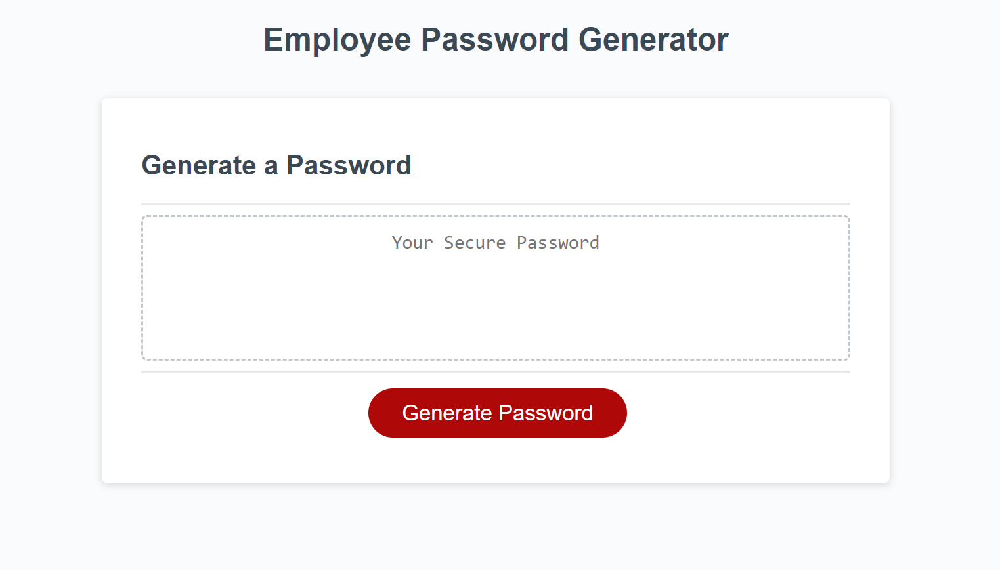
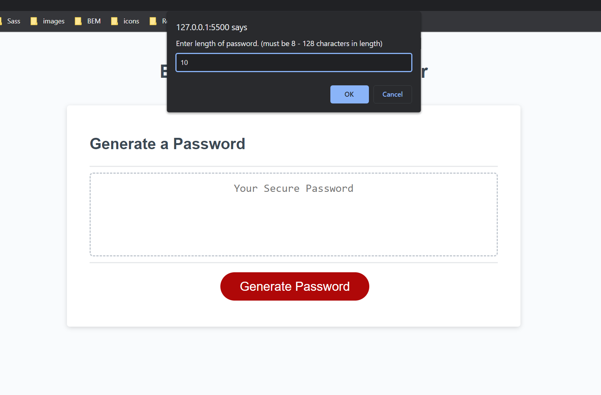
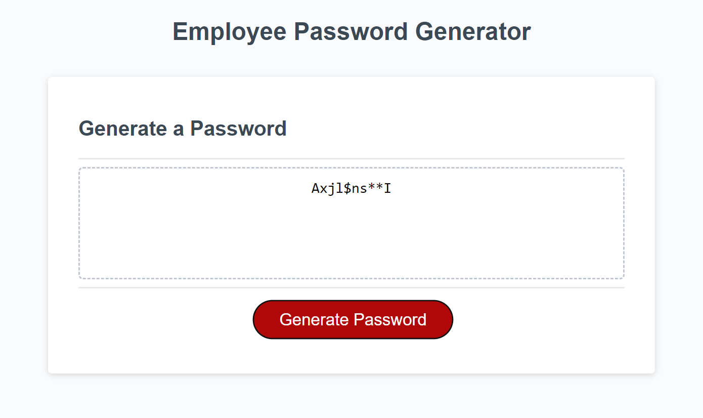

# Employee Password Generator

The motivation for the project was to solve the problem of coming up with a secure unique password in the workplace.
The Password Generator allows an employee to generate a random password based on criteria they've selected when prompted:

## Usage

- Choose a length of at least 8 characters and no more than 128 characters
- Confirm whether or not to include lowercase, uppercase, numeric, and/or special
  characters
- One character type must be selected.

This generator improves workplace security by helping employees in choosing stronger unique passwords.

[Repository URL:](https://github.com/DexterDick/employee-password-generator)

[Employee Password Generator URL:](https://dexterdick.github.io/employee-password-generator/)

## Screenshot

